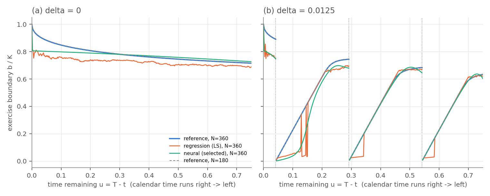

*Reference and draw order.* The assignment refers to a supplied `reference_solver.py`, `reference_results.npz` and `README.md`. We did not receive these, so the numerical reference is our own independently validated grid solver (Section 2), and the random-draw order is our own documented choice. Both are isolated in `reference.py` and `simulation.py` / `nn_policy.py`, so the supplied versions can be substituted and `python run_all.py` rerun.

# 1. The exercise boundary

**Axes.** The horizontal axis is $u=T-t$, so **calendar time advances right to left**.

**Item 1.** Just before a dividend, the put holder can exercise for $K-s$ or hold through the jump. Nothing random happens between $d_k^{-}$ and $d_k^{+}$, and the put receives no dividend. So

$$V_\delta(d_k^{-},s)=\max\{(K-s)^{+},V_\delta(d_k^{+},(1-\delta)s)\}.$$

Exercising just after the jump is always possible, so $V_\delta(d_k^{+},(1-\delta)s)\ge K-(1-\delta)s=(K-s)+\delta s>K-s$ for $0<s<K$. The maximum is therefore always the second term, which gives the identity. Exercising after the jump pays $\delta s$ more at no interest cost, so the jump may be applied before the exercise decision.

**Item 2.** Let $t=d_k-\varepsilon$ lie after $d_{k-1}$. The strategy "wait until $d_k^{+}$, then exercise" is feasible, and $\mathbb E[S_{d_k^{-}}\mid S_t=s]=se^{r\varepsilon}$, so

$$V_\delta(t,s)\ge e^{-r\varepsilon}\big(K-(1-\delta)se^{r\varepsilon}\big)=Ke^{-r\varepsilon}-(1-\delta)s .$$

If $s$ is in the exercise region, $K-s\ge Ke^{-r\varepsilon}-(1-\delta)s$, i.e. $s\le K(1-e^{-r\varepsilon})/\delta$. Hence $b_\delta(d_k-\varepsilon)\le K(1-e^{-r\varepsilon})/\delta\approx Kr\varepsilon/\delta\to0$.

*Grid version.* The dividend date is itself an exercise date, so stopping there is an admissible grid stopping time and the same bound holds with $\varepsilon=(j_d-j)h$. Our solver satisfies the lower bound at every node.

*Proximity depends on $s$.* A fixed $s$ is never exercised when $\varepsilon<\varepsilon^{*}(s)=-r^{-1}\log(1-\delta s/K)\approx\delta s/(rK)$. That is about 9 days at $s=10$ and about 75 days at $s=80$. The bound makes this precise because it compares $\delta s$ directly with $K(1-e^{-r\varepsilon})$.

*Positive values on the grid.* One grid step before a dividend the bound is still positive: $K(1-e^{-rh})/\delta=1.63$ ($N=180$) and $0.81$ ($N=360$). These shrink linearly in $h$, which is consistent with a zero limit as $\varepsilon\downarrow0$. In fact the computed boundary lies *on* the bound for about 0.13 years before each dividend: for small $s$, exercise at $d_k^{+}$ is almost certain, so the bound is attained. This produces the straight segments with slope $\approx rK/\delta$ in Cox and Rubinstein's figure.

*Jump and maturity.* In calendar time the boundary jumps **up** at each $d_k$ (to $0.69K$, $0.75K$, $0.89K$), because once the dividend is paid there is no reason left to wait for it. After $d_3$ no dividend remains and $r>0$, so the boundary tends to $K$ at maturity, as in the $\delta=0$ curve of Cox and Rubinstein's Fig. 5-37 (Cox and Rubinstein 1985).

**Item 3.** Drive both models from $(t_j,s)$ with the same Brownian increments. Then $S^\delta_i=S^0_i(1-\delta)^{n_{ji}}\le S^0_i$, where $n_{ji}$ counts the dividends in $(t_j,t_i]$. Each price path is a one-to-one function of those increments, so both models share one set of stopping times. For any common $\tau$, $(K-S^\delta_\tau)^{+}\ge(K-S^0_\tau)^{+}$ on every path. Taking discounted expectations and then the supremum over $\tau$ gives $V_{0.0125,N}\ge V_{0,N}$.

If $V_\delta(t_j,s)=K-s$, then $K-s=V_\delta\ge V_0\ge K-s$. So the exercise regions are nested and $b_{0.0125,N}\le b_{0,N}$. For $t_j\ge d_3$, including $t_j=d_3$ compared at the same *post-jump* price, no dividend remains and the two problems coincide.

A coupled simulation shows why the common $\tau$ matters. With one $\tau$ no path violates dominance. When each model uses its own threshold rule, 12.4% of paths do.

**Item 4.** The call's intrinsic value *falls* at the jump. Exercising first captures the dividend, so

$$C_\delta(d_k^{-},s)=\max\{(s-K)^{+},C_\delta(d_k^{+},(1-\delta)s)\},$$

and the maximum can bind. A call code must therefore test exercise **before** applying the dividend. For the put this pre-jump test is redundant (item 1). Checked on our grid: the correct call is worth 10.4198 at $S_0=100$. Deciding after the jump gives 10.4029, because the call then exercises one step early. The European call is worth 9.9037.

**Checks using the computed boundaries** ($g_j=b^{0.0125}_j-b^0_j$):

| $N$ | Method | $A$ | $B$ | $F$ |
|---|---|---|---|---|
| 180 | ref | 0 | 0.000 | 0.000 |
| 180 | LS | 0 | 0.000 | 0.200 |
| 180 | NN | 32 | 0.134 | 0.151 |
| 360 | ref | 0 | 0.000 | 0.000 |
| 360 | LS | 0 | 0.000 | 0.103 |
| 360 | NN | 0 | 0.000 | 0.056 |

The reference is exactly ordered: $A=B=F=0$, and $\max_s(V^{ref}_{0,N}-V^{ref}_{0.0125,N})^{+}=0$. Neither fitted method is constrained to respect the ordering, so their diagnostics measure **learning error**:

* $F>0$ after $d_3$, where the two problems are identical. The two fits come from different samples, and the $\delta$ paths sit lower after three dividends.
* The NN violations at $N=180$ ($A=32$) come from case 0. Its selected checkpoint let the early-date boundary drift down to about $0.49K$ (Section 4).

# 2. Reference, simulation and the cap

**Reference.** Our solver uses a uniform $\log S$ grid with $S=K$ on a node:

* The Gaussian step is integrated exactly for the piecewise-linear interpolant, with a $dx^2/6$ variance correction. Without it, the European error grew with $N$.
* The dividend is an exact shift of 10 grid nodes.
* European prices match the closed form to about $2\times10^{-5}$.

| Change | Max price change (\$) | Max boundary change (\$) |
|---|---|---|
| Spatial ($dx/2$, $dx/4$) | 2e-5 | 1e-3 |
| Time integration ($h/2$, $h/4$) | 7e-9 | 2e-6 |
| Domain / kernel tails | $\le 10^{-14}$ | $\le 3\times10^{-12}$ |
| $N$: 180 → 360 (different problem) | 2e-3 | 0.305 |

Refinement approximates the *same* problem more closely. Changing $N$ changes the *problem*: more exercise rights raise the value and move the boundary about 100 times more than any refinement. So an accuracy gain smaller than about $10^{-5}$ \$ in price or $10^{-3}$ \$ in boundary cannot be resolved against this reference.

**Simulation.** We sample the exact lognormal step and apply $(1-\delta)$ on arrival at an integer dividend index. A path that starts at a dividend date is already post-jump. On the final $S_0=100$ samples, $(\bar S_T-S_0e^{rT}(1-\delta)^3)/\mathrm{SE}=$ 0.12, 0.62, 1.96, 0.23 for cases 0–3.

The optimal boundary lies on the cap $U_j$ close to each dividend, which is why both fitted policies are given the cap rather than learning it.

# 3. Least-squares policy

We follow the specified recursion: a cubic regression in $x=S_j/K$ on in-the-money rows (SVD least squares), then clipping, the largest $+/-$ crossing of $H$, and the cap.

*Clipping.* The next possible exercise is at $t_{j+1}$ and pays at most $K$, so continuation in time-zero dollars lies in $[0,Ke^{-rt_{j+1}}]$. Hence $H_0\ge Ke^{-rt_j}(1-e^{-rh})>0$: exercise always wins at $s=0$.

*Replay.* Replaying the frozen rule forward reproduces the backward targets exactly.

| Case | $N$ | $\delta$ | Fallbacks | Multi-crossing dates | Capped dates | Replay $\max|Q-Y|$ |
|---|---|---|---|---|---|---|
| 0 | 180 | 0.0 | 0 | 179 | 0 | 0 |
| 1 | 180 | 0.0125 | 0 | 142 | 85 | 0 |
| 2 | 360 | 0.0 | 0 | 360 | 0 | 0 |
| 3 | 360 | 0.0125 | 0 | 264 | 149 | 0 |

*Two crossings on almost every date.* A single cubic over $x\in[0.001,1]$ cannot follow the value function's curvature. As a result $H$ dips below zero near $s\approx3$ and turns positive again below the true boundary. The largest-crossing rule keeps one exercise interval $(0,b]$, discarding the spurious continuation pocket in between.

*Low bias, downward spikes and capping.*

* With $\delta=0$ the fit is biased about $0.03$–$0.05K$ low and is noisy near maturity, where the value function has a kink.
* Further from a dividend, the exercise premium $\delta s-K(1-e^{-r\varepsilon})$ is only cents, below the regression's resolution. There the cubic sometimes returns only the low crossing, which produces the downward spikes in Fig. 1(b).
* Close to each dividend the cap takes over. It binds on 85 dates ($N=180$) and 149 dates ($N=360$).

# 4. Neural policy

**Set-up.** We follow the specified design:

* **Networks:** one per interval, `Linear(1,8)`–tanh–`Linear(8,1)`, with $b_\theta=U_j\,\mathrm{sigmoid}(f_\theta)$, so the cap is built in.
* **Warm start:** 1,000 supervised Adam steps towards $\hat b^{LS}$.
* **Payoff stage:** 2,400 Adam steps on the smoothed payoff, with batches of 512 from 8,192 random-start paths.
* **Precision:** training in float32; validation in float64.
* **Cost:** 19 s supervised plus 64 s payoff training for all four cases on 2 CPU threads.

**Randomised stopping.** If the holder has not yet stopped, they stop at $t_j$ with probability $p_j$, independently of the future. Then $w_j=p_j\prod_{k<j}(1-p_k)$ is the probability of stopping *first* at $t_j$, and $\sum_jw_j=1$ because $p_N=1$. So $R_\theta$ is the path-conditional expectation of the discounted payoff under this randomised rule. It is smooth in $\theta$, and it tends to the hard rule as $\epsilon\to0$; with $\epsilon=10^{-7}$ it matches the hard rule to within $10^{-6}$ \$.

| Case | Ckpt-0 mean | Selected | Selected mean | Gain vs ckpt 0 (SE) | $E^{NN}_{mean}$: ckpt 0 → selected |
|---|---|---|---|---|---|
| 0 | 58.5085 | 2400 | 58.5307 | 0.022 (0.041) | 0.065 → 0.078 |
| 1 | 58.4086 | 0 | 58.4086 | 0.000 (0.000) | 0.019 → 0.019 |
| 2 | 59.3109 | 2400 | 59.3656 | 0.055 (0.038) | 0.056 → 0.023 |
| 3 | 60.5485 | 0 | 60.5485 | 0.000 (0.000) | 0.043 → 0.043 |

**Checkpoint selection.** Every paired validation gain is within about 2 SE of zero, so on 4,096 random-start paths the checkpoints are statistically indistinguishable.

* **Cases 1 and 3:** checkpoint 0 is selected, i.e. the smoothed LS warm start.
* **Case 2:** payoff training more than halved the boundary error.
* **Case 0:** the selected checkpoint has a *worse* boundary. Near $t_0$ it drifted to about $0.49K$, a region few random-start validation paths visit.

**Research connection.**

* *Becker, Cheridito and Jentzen (2019)* decompose a stopping time into 0–1 stop/continue decisions, one network per date. During training each decision is relaxed to a logistic output in $(0,1)$, and the networks are trained **backward, one date at a time**. The economic objective is the **optimal-stopping value**: maximise the expected reward of the stopping time. The learned rule gives a lower bound, and a dual martingale gives an upper bound and confidence intervals.
* *Bühler et al. (2019)* parametrise the **hedging strategy** by semi-recurrent networks and train it with mini-batch Adam directly on simulated paths. The economic objective is to **minimise a convex risk measure** (e.g. expected shortfall, entropic risk) of the hedged terminal position under frictions such as transaction costs. This gives indifference prices $p(Z)=\pi(-Z)-\pi(0)$.
* Our payoff stage uses Becker et al.'s relaxation, but on a single threshold parametrisation trained **jointly over all dates**. It is optimised by stochastic gradient on simulated paths, as in deep hedging, but with a risk-neutral **expected-payoff** objective rather than a risk measure.

# 5. Values and boundaries

**Prices.** 50,000 independent paths per start (seed $4000+10c+a$), shared by all policies, in float64:

| Case | $N$ | $\delta$ | $S_0$ | Reference | LS mean (SE) | NN mean (SE) |
|---|---|---|---|---|---|---|
| 0 | 180 | 0.0 | 60 | 40.0000 | 40.0000 (0.000) | 39.1302 (0.039) |
| 0 | 180 | 0.0 | 80 | 20.8688 | 20.6526 (0.056) | 20.5836 (0.056) |
| 0 | 180 | 0.0 | 100 | 8.8078 | 8.6484 (0.050) | 8.7598 (0.046) |
| 1 | 180 | 0.0125 | 60 | 40.0000 | 40.0000 (0.000) | 39.9710 (0.010) |
| 1 | 180 | 0.0125 | 80 | 22.1095 | 21.9971 (0.063) | 22.0096 (0.063) |
| 1 | 180 | 0.0125 | 100 | 10.1264 | 10.0287 (0.055) | 10.0334 (0.055) |
| 2 | 360 | 0.0 | 60 | 40.0000 | 40.0000 (0.000) | 40.0000 (0.000) |
| 2 | 360 | 0.0 | 80 | 20.8710 | 20.6604 (0.054) | 20.8215 (0.042) |
| 2 | 360 | 0.0 | 100 | 8.8091 | 8.6117 (0.049) | 8.6885 (0.046) |
| 3 | 360 | 0.0125 | 60 | 40.0000 | 40.0000 (0.000) | 40.0000 (0.000) |
| 3 | 360 | 0.0125 | 80 | 22.1102 | 22.0697 (0.063) | 22.0652 (0.062) |
| 3 | 360 | 0.0125 | 100 | 10.1270 | 10.0733 (0.055) | 10.0726 (0.055) |

The frozen rule is an admissible stopping time, so its expected payoff is at most $V_{\delta,N}(0,S_0)$, and fresh paths make the sample mean unbiased for it. Consistently, no fitted mean exceeds the reference: the largest $(\text{mean}-V^{ref})/\mathrm{SE}$ is -0.65. Interval endpoints are in `results.csv`.

Paired against the reference boundary applied on the same paths, at $S_0\in\{80,100\}$:

* LS loses 0.02–0.19 \$ and the NN loses 0.01–0.26 \$.
* The NN beats LS in case 2 (0.03 vs 0.19 \$ at $S_0=80$) and ties LS in cases 1 and 3.
* At $S_0=60$ the NN loses 0.87 \$ in case 0 and 0.03 \$ in case 1, because its $t_0$ boundary sits below 60, so it waits instead of exercising.

**Boundary accuracy.**

| Case | $N$ | $\delta$ | $E^{LS}_{mean}$ | $E^{LS}_{max}$ | $E^{NN}_{mean}$ | $E^{NN}_{max}$ |
|---|---|---|---|---|---|---|
| 0 | 180 | 0.0 | 0.065 | 0.165 | 0.078 | 0.229 |
| 1 | 180 | 0.0125 | 0.032 | 0.235 | 0.019 | 0.165 |
| 2 | 360 | 0.0 | 0.055 | 0.199 | 0.023 | 0.166 |
| 3 | 360 | 0.0125 | 0.047 | 0.388 | 0.043 | 0.229 |

Compare each policy with the reference for the same $N$ first. The optimal boundary itself moves by only $E_{mean}=$ 0.0026 ($\delta=0$) and 0.0008 ($\delta=0.0125$) between $N=180$ and $360$. The fitted errors are 10–100 times larger (LS 0.032–0.065, NN 0.019–0.078). So every change in a fitted policy with $N$ is learning error, set by the fixed budgets and by checkpoint selection, not by the extra exercise dates.

**Price vs boundary accuracy.** Mean boundary errors of 2–8% of $K$ cost only cents in price. The one large loss (case 0, $S_0=60$) comes from an error at a single, heavily visited state rather than a large average error.

**Perturbation** (case 3, $S_0=100$, same evaluation paths):

| $a$ | Mean $Q^{(a)}-Q^{(0)}$ (\$) | SE | Applied mean shift / $K$ | Dates capped at $U_j$ | Paths whose $\tau$ changes |
|---|---|---|---|---|---|
| -0.02 | -0.0191 | 0.0081 | -0.0194 | 0 of 360 | 17.5% (all later) |
| +0.02 | +0.0046 | 0.0090 | +0.0135 | 147 of 360 | 19.4% (all earlier) |

Three effects link boundary changes to price changes:

* **The cap.** It absorbs most of the upward shift: 147 dates are capped, so the applied mean shift is only $0.014K$.
* **States visited.** Only paths that enter the shifted band change decision, about 17–19% of paths.
* **Direction of the change.** Lowering the boundary delays exercise and costs -0.019 \$ (SE 0.008; -0.110 \$ per affected path). Raising it gains +0.005 \$ (SE 0.009), which is not significant.

The asymmetry arises because the NN sits about $0.04K$ below the reference: moving down goes further from the optimum, while moving up approaches it on the flat part of the value surface. A finer sweep (in the code) shows the price is flat within noise for $a\in[0,0.06]$.

# Figures

{width=6.9in}

{width=4.2in}

# Reproducibility and AI use

* **Command:** `python run_all.py`. It reproduces every table and figure (about 3 minutes); a full rerun gave identical outputs apart from the timing columns.
* **Records:** seeds, sizes, versions, hardware (2 CPU threads, no accelerator), precision and timings are in `results.csv` and `fitted/*.json`.
* **Contributions:** Aditi Joshi — [TODO]; Helen Siavelis — [TODO]; Jaskaran Kalra — [TODO]; William McDonnell — [TODO].

**AI use.** We used Claude (Anthropic; configured model identifier claude-opus-5-5, via Cowork) to draft code, derivations and text, and we verified its suggestions. One suggestion we checked computationally: integrating the piecewise-linear transition kernel exactly adds a spurious variance of $dx^2/6$ per step. Without the correction, European errors were about $2.5\times10^{-3}$ ($N=180$) and $5\times10^{-3}$ ($N=360$) and grew with $N$. With it, they fell to about $2\times10^{-5}$, independent of $N$.

# References

Becker, S., Cheridito, P., Jentzen, A. (2019). Deep Optimal Stopping. *JMLR* 20(74), 1–25.

Bühler, H. et al. (2019). Deep Hedging. *Quantitative Finance* 19(8), 1271–1291.

Cox, J.C., Rubinstein, M. (1985). *Options Markets*. Prentice-Hall.

Longstaff, F.A., Schwartz, E.S. (2001). Valuing American Options by Simulation: A Simple Least-Squares Approach. *Review of Financial Studies* 14(1), 113–147.
