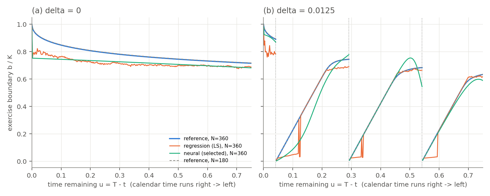

*Conventions.* All reference values and boundaries are the supplied `reference_results.npz` arrays (preserved unchanged), and every random draw follows the supplied `README.md` conventions. Our own independent solver is used only for the Part 1 illustrations and as a cross-check (Section 2).

# 1. The exercise boundary

**Axes.** The horizontal axis is $u=T-t$, so **calendar time advances right to left**.

**Item 1.** Just before a dividend, the put holder can exercise for $K-s$ or hold through the jump. Nothing random happens between $d_k^{-}$ and $d_k^{+}$, and the put receives no dividend. So

$$V_\delta(d_k^{-},s)=\max\{(K-s)^{+},V_\delta(d_k^{+},(1-\delta)s)\}.$$

Exercising just after the jump is always possible, so $V_\delta(d_k^{+},(1-\delta)s)\ge K-(1-\delta)s=(K-s)+\delta s>K-s$ for $0<s<K$. The maximum is therefore always the second term, which gives the identity. Exercising after the jump pays $\delta s$ more at no interest cost, so the jump may be applied before the exercise decision.

**Item 2.** Let $t=d_k-\varepsilon$ lie after $d_{k-1}$. The strategy "wait until $d_k^{+}$, then exercise" is feasible, and $\mathbb E[S_{d_k^{-}}\mid S_t=s]=se^{r\varepsilon}$, so

$$V_\delta(t,s)\ge e^{-r\varepsilon}\big(K-(1-\delta)se^{r\varepsilon}\big)=Ke^{-r\varepsilon}-(1-\delta)s .$$

If $s$ is in the exercise region, $K-s\ge Ke^{-r\varepsilon}-(1-\delta)s$, i.e. $s\le K(1-e^{-r\varepsilon})/\delta$. Hence $b_\delta(d_k-\varepsilon)\le K(1-e^{-r\varepsilon})/\delta\approx Kr\varepsilon/\delta\to0$.

*Grid version.* The dividend date is itself an exercise date, so stopping there is an admissible grid stopping time and the same bound holds with $\varepsilon=(j_d-j)h$. Our cross-check solver's full value surface satisfies the lower bound at every node.

*Proximity depends on $s$.* A fixed $s$ is never exercised when $\varepsilon<\varepsilon^{*}(s)=-r^{-1}\log(1-\delta s/K)\approx\delta s/(rK)$: about 9 days at $s=10$ and 75 days at $s=80$.

*Positive values on the grid.* One grid step before a dividend the bound is still positive: $K(1-e^{-rh})/\delta=1.63$ ($N=180$) and $0.81$ ($N=360$). These shrink linearly in $h$, which is consistent with a zero limit as $\varepsilon\downarrow0$. In fact the reference boundary lies *on* the bound for about 0.13 years before each dividend: for small $s$, exercise at $d_k^{+}$ is almost certain, so the bound is attained. This produces the straight segments with slope $\approx rK/\delta$ in Cox and Rubinstein's figure.

*Jump and maturity.* In calendar time the boundary jumps **up** at each $d_k$ (to $0.69K$, $0.75K$, $0.89K$), because once the dividend is paid there is no reason left to wait for it. After $d_3$ no dividend remains and $r>0$, so the boundary tends to $K$ at maturity, as in the $\delta=0$ curve of Cox and Rubinstein's Fig. 5-37 (Cox and Rubinstein 1985).

**Item 3.** Drive both models from $(t_j,s)$ with the same Brownian increments. Then $S^\delta_i=S^0_i(1-\delta)^{n_{ji}}\le S^0_i$, where $n_{ji}$ counts the dividends in $(t_j,t_i]$. Each price path is a one-to-one function of those increments, so both models share one set of stopping times. For any common $\tau$, $(K-S^\delta_\tau)^{+}\ge(K-S^0_\tau)^{+}$ on every path. Taking discounted expectations and then the supremum over $\tau$ gives $V_{0.0125,N}\ge V_{0,N}$.

If $V_\delta(t_j,s)=K-s$, then $K-s=V_\delta\ge V_0\ge K-s$. So the exercise regions are nested and $b_{0.0125,N}\le b_{0,N}$. For $t_j\ge d_3$, including $t_j=d_3$ compared at the same *post-jump* price, no dividend remains and the two problems coincide.

In a coupled simulation, one common $\tau$ gives no violations, but model-specific threshold rules violate dominance on 12.4% of paths.

**Item 4.** The call's intrinsic value *falls* at the jump. Exercising first captures the dividend, so

$$C_\delta(d_k^{-},s)=\max\{(s-K)^{+},C_\delta(d_k^{+},(1-\delta)s)\},$$

and the maximum can bind. A call code must therefore test exercise **before** applying the dividend. For the put this pre-jump test is redundant (item 1). Checked on our grid: the correct call is worth 10.4198 at $S_0=100$. Deciding after the jump gives 10.4029, because the call then exercises one step early. The European call is worth 9.9037.

**Checks using the computed boundaries** ($g_j=b^{0.0125}_j-b^0_j$):

| $N$ | Method | $A$ | $B$ | $F$ |
|---|---|---|---|---|
| 180 | ref | 0 | 0.000 | 0.000 |
| 180 | LS | 0 | 0.000 | 0.066 |
| 180 | NN | 21 | 0.051 | 0.082 |
| 360 | ref | 0 | 0.000 | 0.000 |
| 360 | LS | 0 | 0.000 | 0.094 |
| 360 | NN | 36 | 0.051 | 0.172 |

The reference is exactly ordered: $A=B=F=0$, and $\max_s(V^{ref}_{0,N}-V^{ref}_{0.0125,N})^{+}=0$. Neither fitted method is constrained to respect the ordering, so their diagnostics measure **learning error**:

* $F>0$ after $d_3$, where the two problems are identical. The two fits come from different samples, and the $\delta$ paths sit lower after three dividends.
* The NN violates the ordering on 21 dates ($N=180$) and 36 dates ($N=360$), by at most $B=$ 0.051. All violations lie just after $d_1$ and $d_2$, where the $\delta$-network overshoots the post-dividend boundary (by up to $0.08K$, Fig. 1b) and so ends up above the $\delta=0$ network.

# 2. Reference, simulation and the cap

**Reference.** `python reference_solver.py --verify` passed: the saved arrays match a recomputation, and the refinements change little.

| Comparison (max over the four cases) | Price change at $S_0\in\{60,80,100\}$ (\$) | Boundary change (\$) |
|---|---|---|
| Spatial: $\Delta S$ 0.10 → 0.05 (16 substeps) | 2e-5 | 2e-3 |
| Time: 16 → 32 substeps ($\Delta S=0.05$) | 2e-5 | 1e-3 |
| Saved arrays vs recomputed | 4e-12 | 2e-10 |
| Our independent log-grid solver vs saved arrays | 8e-6 | 1e-3 |
| $N$: 180 → 360 (a different problem) | 2e-3 | 0.306 |

The largest boundary changes occur on the last exercise date, where the boundary is steepest. As an independent check, our own solver agrees with the supplied arrays to within the reference's own refinement changes. Our solver uses a different method: an exact Gaussian step on a $\log S$ grid, with a $dx^2/6$ variance correction.

Refinement approximates the *same* problem more closely. Changing $N$ changes the *problem*: more exercise rights raise the value, and the boundary moves over 100 times more than under any refinement. The reference is precise to about $2\times10^{-5}$ \$ in price and $2\times10^{-3}$ \$ in boundary, so smaller claimed accuracy gains cannot be resolved.

**Simulation.** We sample the exact lognormal step, adding $\log(1-\delta)$ in the column that arrives at each integer dividend index (the README arithmetic). A path that starts at a dividend date is already post-jump. On the final $S_0=100$ samples, $(\bar S_T-S_0e^{rT}(1-\delta)^3)/\mathrm{SE}=$ 0.12, 0.62, 1.96, 0.23 for cases 0–3.

# 3. Least-squares policy

We follow the specified recursion: a cubic regression in $x=S_j/K$ on in-the-money rows (SVD least squares), then clipping, the largest $+/-$ crossing of $H$, and the cap.

*Clipping.* The next possible exercise is at $t_{j+1}$ and pays at most $K$, so continuation in time-zero dollars lies in $[0,Ke^{-rt_{j+1}}]$. Hence $H_0\ge Ke^{-rt_j}(1-e^{-rh})>0$: exercise always wins at $s=0$.

*Replay.* Replaying the frozen rule forward reproduces the backward targets exactly.

| Case | $N$ | $\delta$ | Fallbacks | Multi-crossing dates | Capped dates | Replay $\max|Q-Y|$ |
|---|---|---|---|---|---|---|
| 0 | 180 | 0.0 | 0 | 176 | 0 | 0 |
| 1 | 180 | 0.0125 | 0 | 138 | 83 | 0 |
| 2 | 360 | 0.0 | 0 | 360 | 0 | 0 |
| 3 | 360 | 0.0125 | 0 | 273 | 154 | 0 |

*Two crossings on almost every date.* A single cubic over $x\in[0.001,1]$ cannot follow the value function's curvature. As a result $H$ dips below zero near $s\approx3$ and turns positive again below the true boundary. The largest-crossing rule keeps one exercise interval $(0,b]$, discarding the spurious continuation pocket in between.

*Low bias, downward spikes and capping.*

* With $\delta=0$ the fit is biased about $0.065K$ low on average and is noisy near maturity, where the value function has a kink.
* Further from a dividend, the exercise premium $\delta s-K(1-e^{-r\varepsilon})$ is only cents, below the regression's resolution. There the cubic sometimes returns only the low crossing, which produces the downward spikes in Fig. 1(b).
* Close to each dividend the cap takes over. It binds on 83 dates ($N=180$) and 154 dates ($N=360$).

# 4. Neural policy

**Set-up.** We follow the specified design:

* **Networks:** one per interval, `Linear(1,8)`–tanh–`Linear(8,1)`, with $b_\theta=U_j\,\mathrm{sigmoid}(f_\theta)$, so the cap is built in.
* **Warm start:** 1,000 supervised Adam steps towards $\hat b^{LS}$.
* **Payoff stage:** 2,400 Adam steps on the smoothed payoff, with batches of 512 from 8,192 random-start paths.
* **Precision:** training in float32; validation in float64.
* **Cost:** 4 s supervised plus 41 s payoff training for all four cases, with 2 CPU threads, 1 inter-op thread and deterministic algorithms (README settings).

**Randomised stopping.** If the holder has not yet stopped, they stop at $t_j$ with probability $p_j$, independently of the future. Then $w_j=p_j\prod_{k<j}(1-p_k)$ is the probability of stopping *first* at $t_j$, and $\sum_jw_j=1$ because $p_N=1$. So $R_\theta$ is the path-conditional expectation of the discounted payoff under this randomised rule. It is smooth in $\theta$, and it tends to the hard rule as $\epsilon\to0$; with $\epsilon=10^{-7}$ it matches the hard rule to within $10^{-6}$ \$.

| Case | Ckpt-0 mean | Selected | Selected mean | Gain vs ckpt 0 (SE) | $E^{NN}_{mean}$: ckpt 0 → selected |
|---|---|---|---|---|---|
| 0 | 59.1551 | 2000 | 59.1626 | 0.008 (0.006) | 0.069 → 0.072 |
| 1 | 58.9883 | 2000 | 59.0156 | 0.027 (0.028) | 0.019 → 0.017 |
| 2 | 59.3921 | 1200 | 59.3945 | 0.002 (0.009) | 0.064 → 0.062 |
| 3 | 60.5318 | 2400 | 60.5550 | 0.023 (0.035) | 0.029 → 0.043 |

**Checkpoint selection.** The selected checkpoints are 2000, 2000, 1200, 2400 for cases 0–3; checkpoint 0 was never selected. Every selected gain over checkpoint 0 is within 1.3 paired SE, so on 4,096 random-start paths the checkpoints are statistically indistinguishable, and selection is close to picking among equals.

Payoff training changed the boundary error little in cases 0–2. In case 3 it made the boundary *worse* ($E_{mean}$ 0.029 → 0.043): it overshoots the reference after $d_1$ and sits below it between $d_2$ and $d_3$. The validation mean barely reacts, because the value is flat near the optimal threshold (Section 5).

**Research connection.**

* *Becker, Cheridito and Jentzen (2019)* learn one stop/continue network per date, relaxed to a logistic probability and trained **backward, one date at a time**. Economic objective: the **optimal-stopping value**, i.e. maximising the expected reward. The learned rule gives a lower bound; a dual martingale gives an upper bound.
* *Bühler et al. (2019)* train semi-recurrent **hedging-strategy** networks with Adam on simulated paths. Economic objective: **minimise a convex risk measure** (e.g. expected shortfall) of hedged P&L under transaction costs, which yields indifference prices.
* Our payoff stage borrows Becker et al.'s relaxation, applied to one threshold trained **jointly over all dates**, and optimises it on simulated paths as in deep hedging, but for **expected payoff** rather than a risk measure.

# 5. Values and boundaries

**Prices.** 50,000 independent paths per start (seed $4000+10c+a$), shared by all policies, in float64:

| Case | $N$ | $\delta$ | $S_0$ | Reference | LS mean (SE) | NN mean (SE) |
|---|---|---|---|---|---|---|
| 0 | 180 | 0.0 | 60 | 40.0000 | 40.0000 (0.000) | 40.0000 (0.000) |
| 0 | 180 | 0.0 | 80 | 20.8688 | 20.6611 (0.056) | 20.6321 (0.056) |
| 0 | 180 | 0.0 | 100 | 8.8078 | 8.6398 (0.050) | 8.6232 (0.050) |
| 1 | 180 | 0.0125 | 60 | 40.0000 | 40.0000 (0.000) | 40.0000 (0.000) |
| 1 | 180 | 0.0125 | 80 | 22.1096 | 22.0170 (0.062) | 22.0286 (0.058) |
| 1 | 180 | 0.0125 | 100 | 10.1264 | 10.0426 (0.054) | 10.0477 (0.053) |
| 2 | 360 | 0.0 | 60 | 40.0000 | 40.0000 (0.000) | 40.0000 (0.000) |
| 2 | 360 | 0.0 | 80 | 20.8710 | 20.6009 (0.055) | 20.6331 (0.055) |
| 2 | 360 | 0.0 | 100 | 8.8091 | 8.5857 (0.050) | 8.5934 (0.050) |
| 3 | 360 | 0.0125 | 60 | 40.0000 | 40.0000 (0.000) | 39.9550 (0.021) |
| 3 | 360 | 0.0125 | 80 | 22.1102 | 22.0870 (0.063) | 22.0273 (0.055) |
| 3 | 360 | 0.0125 | 100 | 10.1270 | 10.0716 (0.055) | 10.0685 (0.052) |

The frozen rule is an admissible stopping time, so its expected payoff is at most $V_{\delta,N}(0,S_0)$, and fresh paths make the sample mean unbiased for it. Consistently, no fitted mean exceeds the reference: the largest $(\text{mean}-V^{ref})/\mathrm{SE}$ is -0.37. Interval endpoints are in `results.csv`.

Paired against the reference boundary applied on the same paths, at $S_0\in\{80,100\}$:

* LS loses 0.02–0.25 \$ and the NN loses 0.01–0.22 \$.
* At $S_0=80$, NN vs LS:
  * the NN beats LS in case 2 by 0.032 \$ (SE 0.014);
  * LS beats the NN in case 0 by 0.029 \$ (SE 0.010) and in case 3 by 0.060 \$ (SE 0.031);
  * the two tie in case 1.
* At $S_0=60$ every policy exercises at once except the case-3 NN. Its $t_0$ boundary sits just below 60, so it waits, and loses 0.045 \$ (SE 0.021).

**Boundary accuracy.**

| Case | $N$ | $\delta$ | $E^{LS}_{mean}$ | $E^{LS}_{max}$ | $E^{NN}_{mean}$ | $E^{NN}_{max}$ |
|---|---|---|---|---|---|---|
| 0 | 180 | 0.0 | 0.069 | 0.204 | 0.072 | 0.222 |
| 1 | 180 | 0.0125 | 0.034 | 0.237 | 0.017 | 0.155 |
| 2 | 360 | 0.0 | 0.064 | 0.219 | 0.062 | 0.220 |
| 3 | 360 | 0.0125 | 0.037 | 0.292 | 0.043 | 0.173 |

Compare each policy with the reference for the same $N$ first. The optimal boundary itself moves by only $E_{mean}=$ 0.0026 ($\delta=0$) and 0.0008 ($\delta=0.0125$) between $N=180$ and $360$. The fitted errors are 7–90 times larger (LS 0.034–0.069, NN 0.017–0.072). So a fitted policy's change with $N$ is learning error (fixed budgets, checkpoint selection), not the extra exercise dates.

**Price vs boundary accuracy.** Mean boundary errors of 2–7% of $K$ cost at most about 0.25 \$ in price, and usually a few cents. The two need not rank policies alike: in case 3 the NN has the smaller maximum error but the larger price loss, because what matters is the error where paths decide.

**Perturbation** (case 3, $S_0=100$, same evaluation paths):

| $a$ | Mean $Q^{(a)}-Q^{(0)}$ (\$) | SE | Applied mean shift / $K$ | Dates capped at $U_j$ | Paths whose $\tau$ changes |
|---|---|---|---|---|---|
| -0.02 | +0.0218 | 0.0105 | -0.0197 | 0 of 360 | 21.8% (all later) |
| +0.02 | -0.0162 | 0.0114 | +0.0134 | 148 of 360 | 23.9% (all earlier) |

Three effects link boundary changes to price changes:

* **The cap.** It absorbs much of the upward shift: 148 dates are capped, so the applied mean shift is only 0.013$K$.
* **States visited.** Only paths that enter the shifted band change decision: 22% of paths for $a=-0.02$ and 24% for $a=+0.02$.
* **Direction of the change.**
  * Lowering the boundary delays exercise and *gains* +0.022 \$ (SE 0.011; +0.100 \$ per affected path).
  * Raising it makes those paths exercise earlier and changes the price by -0.016 \$ (SE 0.011).

The sign pattern follows where the NN is wrong along the paths. It lies $0.031K$ below the reference on average, but overshoots by up to $0.08K$ just after $d_1$. The gain from lowering it is consistent with those early-exercise errors dominating at $S_0=100$. Our finer sweep (in the code) stays within about 0.022 \$ of zero for $a\in[-0.08,0]$ and falls steadily for $a>0$ (-0.29 \$ at $a=0.08$). Exercising too early is costly; waiting a little longer is almost free.

# Figures

{width=5.8in}

{width=3.2in}

# Reproducibility and AI use

* **Command:** `python run_all.py`. Reproduces every table and figure in about 3 minutes; reruns are identical apart from timings.
* **Records:** seeds, sizes, versions, hardware (2 CPU threads, no accelerator), precision and timings are in `results.csv` and `fitted/*.json`. Run on Python 3.11 (README: 3.12); `--verify` still passed.
* **Contributions:** Aditi Joshi — [TODO]; Helen Siavelis — [TODO]; Jaskaran Kalra — [TODO]; William McDonnell — [TODO].

**AI use.** We used Claude (Anthropic; model identifier claude-opus-5-5, via Cowork) to draft code, derivations and text, and verified its suggestions. One we checked computationally: the piecewise-linear kernel of our cross-check solver adds a spurious variance $dx^2/6$ per step. Without correcting it, European errors grew with $N$ (about $2.5\times10^{-3}$ at $N=180$, $5\times10^{-3}$ at $N=360$); with it they fell to about $2\times10^{-5}$.

# References

Becker, S., Cheridito, P., Jentzen, A. (2019). Deep Optimal Stopping. *JMLR* 20(74), 1–25.

Bühler, H. et al. (2019). Deep Hedging. *Quantitative Finance* 19(8), 1271–1291.

Cox, J.C., Rubinstein, M. (1985). *Options Markets*. Prentice-Hall.

Longstaff, F.A., Schwartz, E.S. (2001). Valuing American Options by Simulation: A Simple Least-Squares Approach. *Review of Financial Studies* 14(1), 113–147.
